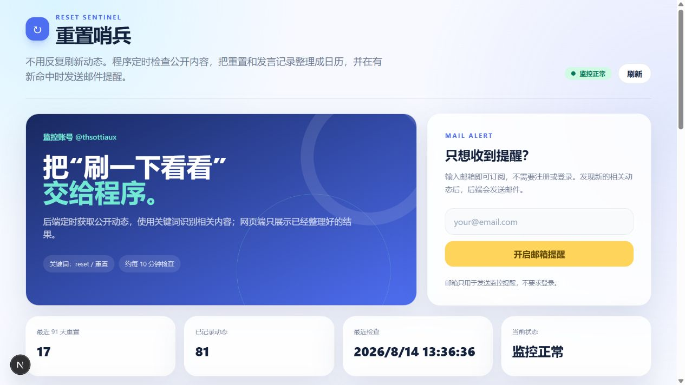

# 重置哨兵

[English](README.md)

这是“重置哨兵”的网页端与后端开源版本：定时检查公开 X 动态，使用关键词识别相关内容，将重置记录和发言记录整理成日历，并在出现新命中时发送邮件提醒。



## 功能

- 定时监控公开动态并识别关键词。
- 展示重置记录、发言记录、最近命中和指定日期详情。
- 用户无需注册或登录，输入邮箱即可订阅提醒。
- 在 `admin/index.html` 中配置 SMTP、发送测试邮件和管理订阅邮箱。
- `CLASHCTL_COMMAND` 为空时不执行 `clashctl`，直接使用系统代理。
- 支持先用 mock 数据启动，确认页面后再接入真实数据源。

## 项目结构

```text
web/                 Next.js + React + Tailwind CSS 网页端
server/              NestJS 后端、监控服务、SQLite 和 SMTP 邮件提醒
admin/index.html     SMTP 和邮箱订阅管理后台
docs/screenshots/    README 网页截图
```

## 本地启动

### 1. 启动后端

```powershell
cd server
Copy-Item .env.example .env
npm install
npm run build
npm run start
```

### 2. 启动前端

```powershell
cd web
npm install
Copy-Item .env.example .env.local
npm run dev
```

默认前端请求 `http://127.0.0.1:3000`。后端地址不同时，修改 `web/.env.local` 中的 `NEXT_PUBLIC_API_BASE_URL`。

## 邮箱提醒

可以通过 `server/.env` 配置 SMTP，也可以打开 `admin/index.html`，在邮箱提醒页面配置。网页端只需要输入邮箱，用户不需要注册或登录。

后台支持：

- SMTP 主机、端口、安全模式、用户名、发件人和授权码。
- 正式启用提醒前发送测试邮件。
- SMTP 敏感字段脱敏，并通过眼睛图标明确显示完整内容。
- 启用、停用和删除订阅邮箱。

通过后台保存后，SMTP 授权码会写入本地 SQLite 的 `meta` 表。生产环境必须限制数据库文件权限，不能提交数据库文件或 `.env` 文件。

## 数据源和代理

开源副本不包含 X 登录 Cookie、真实数据库、用户邮箱、头像、日志、SMTP 凭据或生产环境配置。使用真实爬虫时，请在本地准备自己的 Cookie 文件，并通过 `X_COOKIES_FILE` 指定，禁止提交该文件。

如果本地已经由系统提供代理，请保持下面配置为空：

```env
CLASHCTL_COMMAND=
```

此时后端不会执行代理切换命令，而是直接使用系统代理。只有在服务器明确允许执行本地代理控制命令时，才配置 `CLASHCTL_COMMAND`。

## 安全说明

- 复制 `.env.example` 为 `.env`，并替换所有占位值。
- 为 `JWT_SECRET` 和 `ADMIN_TOKEN` 使用随机长字符串。
- 将 `DB_PATH`、Cookie 文件、日志和 SMTP 凭据排除在版本控制之外。
- 不要在截图、Issue 或 Pull Request 中使用真实 SMTP 凭据。

## 开源许可

本项目使用 [MIT License](LICENSE)。
